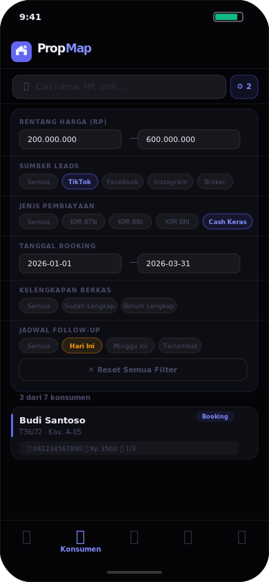
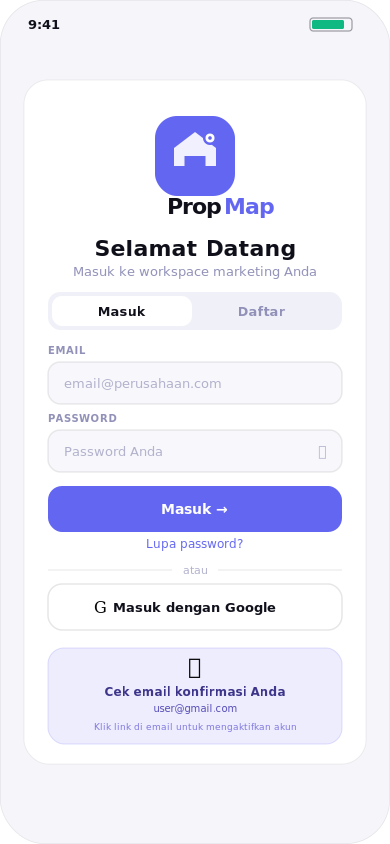

# PropMap — CRM Tim Marketing Properti

<div align="center">


**Aplikasi CRM web real-time untuk monitoring dan pengelolaan data konsumen properti.**
Install di HP (PWA), multi-user, sinkronisasi real-time — lengkap dengan paket langganan Gratis / PRO / Business

[🚀 **Coba Demo**](https://propmapid.netlify.app/demo) · [📱 **Buka Aplikasi**](https://propmapid.netlify.app)

</div>

---

## 📸 Screenshot

<div align="center">
<table>
  <tr>
    <td align="center">
      
      <br/><sub><b>Dashboard</b></sub>
    </td>
    <td align="center">
      
      <br/><sub><b>Daftar Konsumen</b></sub>
    </td>
    <td align="center">
      
      <br/><sub><b>Filter Lanjutan</b></sub>
    </td>
  </tr>
  <tr>
    <td align="center">
      
      <br/><sub><b>Laporan & Target ☀️</b></sub>
    </td>
    <td align="center">
      
      <br/><sub><b>Kalender Follow-up</b></sub>
    </td>
    <td align="center">
      
      <br/><sub><b>Login & Konfirmasi Email ☀️</b></sub>
    </td>
  </tr>
</table>
</div>

---

## 💰 Paket Langganan per Bulan/Tahun

| | Gratis | Pro | Business |
|---|---|---|---|
| **Harga** | Rp 0 | Rp 50.000/bln | Rp 299.000/bln |
| **Konsumen** | Maks 20 | Tidak terbatas | Tidak terbatas |
| **Trial** | — | 14 hari gratis | - |
| Export Excel/PDF/CSV | ✕ | ✓ | ✓ |
| Upload foto berkas | ✕ | ✓ maks 10/item | ✓ tidak terbatas |
| Filter lanjutan & bulan | ✕ | ✓ | ✓ |
| Target penjualan | ✕ | ✓ | ✓ |
| Notifikasi push | ✕ | ✓ | ✓ |
| Backup & restore | ✕ | ✓ (data sendiri) | ✓ (seluruh tim) |
| Mode offline | ✕ | ✓ | ✓ |
| Import Excel/CSV | ✕ | ✓ | ✓ |
| Template KPR per Bank | X | X | ✓ |

> Semua user baru otomatis mendapat **trial Pro 14 hari gratis**.

---

## ✨ Fitur Utama

| Fitur | Keterangan |
|-------|-----------|
| ⚡ **Real-time Sync** | Data tersinkronisasi ke semua HP tim secara instan via WebSocket |
| 👥 **Multi-user & Role** | Login per marketing — Admin lihat semua, Marketing lihat data sendiri |
| 🔐 **Row Level Security** | Data terisolasi di level database PostgreSQL, bukan hanya UI |
| 📲 **PWA** | Install di Android/iPhone seperti aplikasi native tanpa App Store |
| 🌙 **Tema Gelap & Terang** | Toggle dari header, default light, tersimpan otomatis |
| 🔑 **Login Google** | Sign in / sign up satu klik dengan akun Google |
| 📧 **Konfirmasi Email** | Panel verifikasi + kirim ulang email konfirmasi |
| 🔒 **Reset Password** | Link reset via email dengan template branded |
| 📍 **7 Status Pipeline** | Prospek → Booking → Proses DP → Berkas → SP3K/ACC → Selesai / Batal |
| 📅 **Kalender Follow-up** | Tampilan kalender bulanan dengan highlight jadwal follow-up |
| 📁 **Checklist Berkas** | Tambah, edit, hapus item berkas. Upload foto (maks 10/item di Pro) |
| 🔍 **Filter Lanjutan** | Filter harga, sumber leads, KPR, tanggal, berkas, follow-up |
| 📆 **Filter Bulan** | Filter konsumen per bulan booking, input, atau follow-up |
| 📊 **Grafik Laporan** | Chart pipeline, tren 6 bulan, sumber leads — filter periode kustom |
| 🎯 **Target Penjualan** | Target bulanan per marketing + history + bulk set Admin |
| 📗 **Export Excel XLSX** | 3 sheet: data konsumen, ringkasan, performa per marketing |
| 📄 **Export PDF & CSV** | Laporan siap cetak dan data mentah |
| 📥 **Import Excel/CSV** | Upload data konsumen, auto-deteksi nama kolom |
| 📵 **Mode Offline** | IndexedDB cache + sync queue otomatis saat online kembali |
| 💾 **Backup & Restore** | JSON backup + restore Merge/Replace + validasi checksum |
| ⚡ **Optimistic Locking** | Deteksi konflik edit bersamaan + modal diff |
| 🔔 **Notifikasi Push** | Reminder follow-up, berkas kurang, jadwal hari ini |
| 🏆 **Ranking Tim** | Performa dan ranking marketing untuk Admin |
| 📞 **Aksi Cepat** | Telepon dan WhatsApp langsung dari detail konsumen |
| 📌 **Log Aktivitas** | Setiap perubahan tercatat otomatis dengan timestamp |
| 💻 **Layout Desktop** | Sidebar navigasi, konten terpusat, support layar lebar |
| 💳 **Checkout Pembayaran** | Modal upgrade + instruksi transfer + salin nomor rekening & Order ID |
| 🔧 **Panel Aktivasi Admin** | Aktivasi plan user setelah pembayaran dikonfirmasi |

---

## 📋 Pipeline Konsumen

```
📍 Prospek  →  📋 Booking  →  💰 Proses DP  →  📁 Kumpul Berkas  →  🏦 SP3K/ACC  →  ✅ Selesai
                                                                                         ❌ Batal
```

> Status **Prospek** tidak dihitung di Total Konsumen dashboard — masuk hitungan setelah berubah ke Booking.

---

## 🛠 Teknologi

```
Frontend      : HTML5 + CSS3 + Vanilla JavaScript (multi-file, zero framework)
Database      : Supabase (PostgreSQL)
Auth          : Supabase Auth — email/password + Google OAuth + reset password
Real-time     : Supabase Realtime (WebSocket / postgres_changes)
Storage       : Supabase Storage (upload foto dokumen berkas)
Keamanan      : Row Level Security — data terisolasi per user di level DB
Charts        : Chart.js (CDN)
PDF Export    : jsPDF (loaded on demand)
Excel Export  : SheetJS / XLSX (loaded on demand)
Excel Import  : SheetJS / XLSX (loaded on demand)
Offline       : IndexedDB + Service Worker + Background Sync API
PWA           : Service Worker + Web App Manifest
Hosting       : Vercel / Netlify (gratis)
```

---

## 📁 Struktur File

```
PropMap/
├── index.html              # Aplikasi utama
├── demo.html               # Halaman demo & landing page
├── manifest.json           # Konfigurasi PWA
├── sw.js                   # Service Worker (offline + push)
├── setup.sql               # SQL setup lengkap untuk Supabase
├── vercel.json             # Konfigurasi deploy Vercel
├── _redirects              # Konfigurasi redirect Netlify
├── css/
│   └── main.css            # Design tokens, komponen, dark/light mode
├── js/
│   ├── config.js           # Supabase config, state global, PLANS, PRO_FEATURES
│   ├── plan.js             # Sistem monetisasi: plan gate, upgrade modal, checkout, aktivasi
│   ├── helpers.js          # Utility: format rupiah, tanggal, tema, PWA
│   ├── auth.js             # Login, Google OAuth, register, reset, konfirmasi email
│   ├── data.js             # CRUD Supabase, realtime, import/export, optimistic lock
│   ├── ui.js               # Dashboard, konsumen, filter lanjutan, filter bulan
│   ├── laporan.js          # Chart.js, KPI, target, export PDF/Excel/CSV
│   ├── kalender.js         # Kalender follow-up bulanan
│   ├── dokumen.js          # Upload foto, lightbox viewer, checklist berkas
│   ├── target.js           # Target penjualan bulanan per marketing
│   ├── backup.js           # Backup & restore data JSON
│   ├── offline.js          # IndexedDB cache, sync queue, background sync
│   └── push.js             # Web Push Notification
├── assets/
│   ├── email-confirm.html  # Template email konfirmasi akun
│   ├── email-reset.html    # Template email reset password
│   └── SETUP_GOOGLE_EMAIL.md  # Panduan Google OAuth & Gmail SMTP
└── screenshots/            # 6 screenshot SVG untuk README
```
---

## 📖 Panduan Penggunaan

### Untuk Marketing

| Aksi | Cara |
|------|------|
| Tambah konsumen | Tab Konsumen → tombol **＋** kanan bawah |
| Import dari Excel | Konsumen → tombol **📥 Import** |
| Edit konsumen | Detail konsumen → **✏️ Edit** |
| Upload foto berkas | Detail → Checklist Berkas → tombol **📎** (Pro) |
| Jadwal follow-up | Tambah/Edit → isi **Jadwal Follow-up** |
| Filter lanjutan | Konsumen → tombol **⚙ Filter** (Pro) |
| Filter per bulan | Konsumen → tombol **📆 Bulan** (Pro) |
| Backup data sendiri | Pengaturan → **Data Saya → 💾 Backup** (Pro) |
| Upgrade plan | Pengaturan → **Paket Langganan → Upgrade** |

### Untuk Admin

| Aksi | Cara |
|------|------|
| Lihat semua data | Tab Konsumen — otomatis tampil semua tim |
| Set target marketing | Laporan → Target Penjualan → **⚙ Atur Semua** |
| Export laporan | Laporan → **📗 Excel / 📄 PDF / 📊 CSV** |
| Aktivasi plan user | Pengaturan → Panel Admin → **💳 Aktivasi Plan** |
| Backup seluruh tim | Pengaturan → Panel Admin → **💾 Backup & Restore** |
| Kelola pengguna | Pengaturan → **👥 Kelola Pengguna** |

### Install di HP

**Android (Chrome):** Menu ⋮ → *Tambahkan ke layar utama*

**iPhone (Safari):** Tombol Berbagi ↑ → *Tambahkan ke Layar Utama*

---

## ❓ FAQ

**Q: Data marketing bisa dilihat marketing lain?**
A: Tidak. RLS di PostgreSQL memastikan isolasi data di level database.

**Q: Perbedaan Prospek dan Booking?**
A: Prospek belum dihitung di Total Konsumen dashboard. Booking sudah ada komitmen dan mulai dihitung.

**Q: Bisa dipakai offline?**
A: Ya. Data ter-cache di IndexedDB, tambah/edit saat offline masuk antrian sync otomatis.

## 📄 Lisensi

[MIT License](LICENSE) — bebas digunakan, dimodifikasi, dan didistribusikan.

---

<div align="center">
  <strong>PropMap v4.2</strong><br/>
  Dibuat dengan ❤️ untuk tim marketing properti Indonesia<br/><br/>
  <a href="demo.html">Demo</a>
</div>
