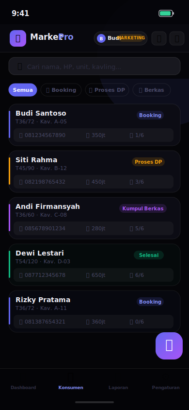
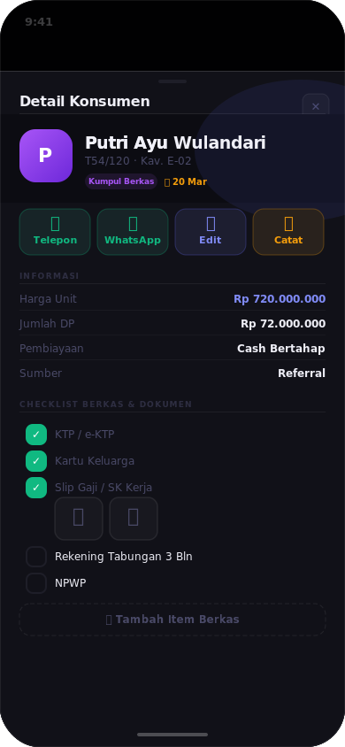
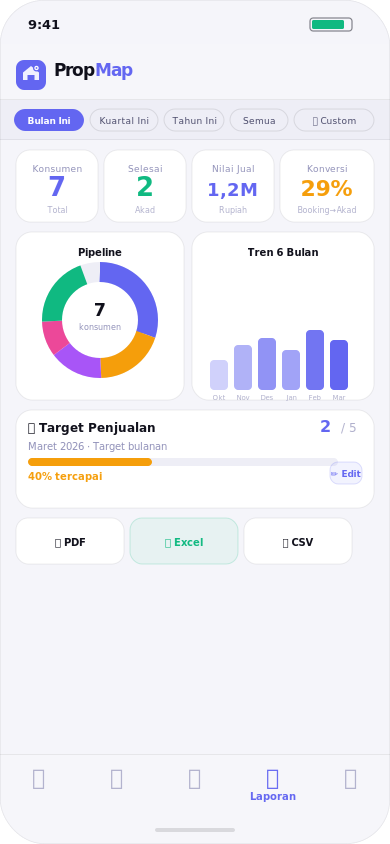
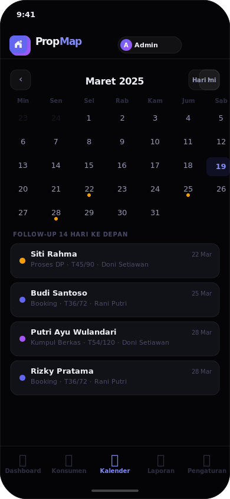

# 🎯 MarketPro — CRM Tim Marketing Properti

<div align="center">


**Aplikasi CRM web real-time untuk monitoring dan pengelolaan data konsumen properti.**  
Install di HP (PWA), multi-user, sinkronisasi real-time, dan kini hadir dengan fitur kalender, grafik, upload dokumen, dan import Excel.

[🚀 **Coba Demo**](demo.html) · [📱 **Buka Aplikasi**](https://marketing-pro-id.vercel.app/)

</div>

---

## 📸 Screenshot

<div align="center">
<table>
  <tr>
    <td align="center">
      
      <br/><sub><b>Dashboard · Gelap</b></sub>
    </td>
    <td align="center">
      
      <br/><sub><b>Daftar Konsumen</b></sub>
    </td>
    <td align="center">
      
      <br/><sub><b>Detail & Berkas</b></sub>
    </td>
    <td align="center">
      
      <br/><sub><b>Laporan ☀️</b></sub>
    </td>
    <td align="center">
      
      <br/><sub><b>Kalender Follow-up</b></sub>
    </td>
  </tr>
</table>
</div>

---

## ✨ Fitur Utama

| Fitur | Keterangan |
|-------|-----------|
| ⚡ **Real-time Sync** | Data tersinkronisasi ke semua HP tim secara instan via WebSocket |
| 👥 **Multi-user & Role** | Login per marketing — Admin lihat semua, Marketing lihat data sendiri |
| 🔐 **Row Level Security** | Data terisolasi di level database PostgreSQL, bukan hanya UI |
| 📲 **PWA** | Install di Android/iPhone seperti aplikasi native tanpa App Store |
| 🌙 **Tema Gelap & Terang** | Toggle dari header, tersimpan otomatis, mengikuti preferensi sistem |
| 📅 **Kalender Follow-up** | Jadwalkan dan pantau follow-up konsumen di tampilan kalender bulanan |
| 📁 **Checklist Berkas Dinamis** | Tambah, edit, hapus item berkas sesuai kebutuhan. Upload foto dokumen ke cloud |
| 📊 **Grafik Laporan** | Chart distribusi pipeline, tren 6 bulan, dan sumber leads dengan Chart.js |
| 📄 **Export PDF & CSV** | Laporan siap cetak dan data lengkap dalam format yang diinginkan |
| 📥 **Import Excel/CSV** | Upload data konsumen dari file Excel sekaligus, auto-deteksi nama kolom |
| 🔔 **Pengingat Otomatis** | Alert follow-up, berkas kurang, DP belum selesai, jadwal hari ini |
| 🏆 **Ranking Tim** | Laporan performa dan ranking marketing untuk Admin |
| 📞 **Aksi Cepat** | Telepon dan WhatsApp langsung dari detail konsumen |
| 📌 **Log Aktivitas** | Setiap perubahan tercatat otomatis dengan timestamp |
| 💻 **Layout Desktop** | Sidebar navigasi, konten terpusat — tidak melebar di layar lebar |

---

## 📋 Pipeline Konsumen

```
📋 Booking  →  💰 Proses DP  →  📁 Kumpul Berkas  →  ✅ Selesai
                                                        ❌ Batal
```

---

## 🛠 Teknologi

```
Frontend      : HTML5 + CSS3 + Vanilla JavaScript (multi-file, zero framework)
Database      : Supabase (PostgreSQL)
Auth          : Supabase Auth (email/password + reset password)
Real-time     : Supabase Realtime (WebSocket / postgres_changes)
Storage       : Supabase Storage (upload foto dokumen)
Keamanan      : Row Level Security — data terisolasi per user di level DB
Charts        : Chart.js (CDN)
PDF Export    : jsPDF (loaded on demand)
Excel Import  : SheetJS / XLSX (loaded on demand)
PWA           : Service Worker + Web App Manifest
Hosting       : Vercel / Netlify (gratis)
Font          : Outfit + JetBrains Mono (Google Fonts)
```

---

## 📁 Struktur File

```
marketpro/
├── index.html              # Aplikasi utama
├── demo.html               # Halaman demo & landing page
├── manifest.json           # Konfigurasi PWA
├── sw.js                   # Service Worker (offline support)
├── setup.sql               # SQL setup lengkap untuk Supabase
├── vercel.json             # Konfigurasi deploy Vercel
├── css/
│   └── main.css            # Semua styling (design tokens, komponen, dark/light)
├── js/
│   ├── config.js           # Konfigurasi Supabase & state global
│   ├── helpers.js          # Utility: format rupiah, tanggal, tema, PWA
│   ├── auth.js             # Login, register, reset password
│   ├── data.js             # CRUD Supabase, realtime, import/export
│   ├── ui.js               # Render dashboard, konsumen, navigasi
│   ├── laporan.js          # Chart.js, laporan KPI, periode filter
│   ├── kalender.js         # Kalender follow-up
│   └── dokumen.js          # Upload/hapus foto dokumen, lightbox viewer
└── screenshots/
    ├── screen-01-dashboard-dark.svg
    ├── screen-02-konsumen-dark.svg
    ├── screen-03-detail-dark.svg
    ├── screen-04-laporan-light.svg
    └── screen-05-kalender-dark.svg
```

---

## 🚀 Cara Setup

### Prasyarat
- Akun [Supabase](https://supabase.com) — gratis
- Akun [Vercel](https://vercel.com) atau [Netlify](https://netlify.com) — gratis

### Langkah 1 — Clone repository

```bash
git clone https://github.com/YOUR_USERNAME/marketpro.git
cd marketpro
```

### Langkah 2 — Setup database di Supabase

Buka **Supabase → SQL Editor** → paste seluruh isi [`setup.sql`](./setup.sql) → klik **Run**.

Script akan membuat:
- Tabel `profiles` (data pengguna & role)
- Tabel `konsumen` (data konsumen properti)
- Storage bucket `dokumen` (upload foto berkas)
- Row Level Security policies lengkap
- Auto-update timestamp trigger

### Langkah 3 — Aktifkan Realtime

```
Supabase Dashboard → Table Editor → konsumen → ⚡ Realtime → Enable
```

Atau via SQL:
```sql
ALTER PUBLICATION supabase_realtime ADD TABLE konsumen;
```

### Langkah 4 — Konfigurasi `js/config.js`

Temukan 2 baris ini dan isi dengan kredensial dari **Supabase → Project Settings → API**:

```javascript
const SUPABASE_URL      = 'https://xxxxxxxxxxxx.supabase.co';
const SUPABASE_ANON_KEY = 'eyJhbGciOiJIUzI1NiIsInR5cCI6IkpXVCJ9...';
```

### Langkah 5 — Deploy ke Hosting

**Vercel** (direkomendasikan):
```bash
npx vercel deploy
```
Atau drag & drop folder ke [vercel.com/new](https://vercel.com/new)

**Netlify:**
Drag & drop folder ke [app.netlify.com/drop](https://app.netlify.com/drop)

### Langkah 6 — Buat Akun Admin Pertama

1. Buka aplikasi → daftar akun baru
2. Buka **Supabase → Table Editor → `profiles`**
3. Cari baris email Anda → ubah kolom `role` dari `marketing` → `admin`
4. Refresh aplikasi ✅

> Setelah jadi Admin, penambahan admin berikutnya bisa dilakukan dari **Pengaturan → Kelola Pengguna**

**Atau via SQL:**
```sql
UPDATE profiles SET role = 'admin' WHERE email = 'email_anda@contoh.com';
```

---

## 📖 Panduan Penggunaan

### Untuk Marketing

| Aksi | Cara |
|------|------|
| Tambah konsumen | Tab Konsumen → tombol **＋** kanan bawah |
| Import dari Excel | Tab Konsumen → tombol **📥 Import dari Excel / CSV** |
| Edit konsumen | Detail konsumen → **✏️ Edit** |
| Centang berkas | Detail → bagian **Checklist Berkas** |
| Upload foto dokumen | Detail → Checklist Berkas → tombol **📎** di sebelah item |
| Tambah item berkas | Detail → **＋ Tambah Item Berkas** |
| Jadwal follow-up | Tambah/Edit konsumen → isi **Jadwal Follow-up** |
| Lihat kalender | Tab **📅 Kalender** |
| Tambah catatan | Detail → **📝 Catat** |
| Telepon / WA | Detail → tombol **📞** / **💬** |
| Lihat pengingat | Tap **🔔** di header |
| Sort nama A-Z | Tab Konsumen → filter row → tombol **A→Z** |
| Ganti tema | Tap **🌙/☀️** di header |

### Untuk Admin

| Aksi | Cara |
|------|------|
| Lihat semua data | Tab Konsumen — otomatis tampil semua tim |
| Filter per marketing | Konsumen → dropdown **Filter tim** |
| Lihat grafik laporan | Tab Laporan → chart pipeline, tren, sumber leads |
| Filter periode laporan | Laporan → pilih Bulan Ini / Kuartal / Tahun / Semua |
| Export PDF | Laporan → tombol **📄 Export PDF** |
| Export CSV | Laporan → tombol **📊 Export CSV** |
| Lihat ranking | Laporan → **🏆 Ranking Tim** |
| Ubah role | Pengaturan → **Kelola Pengguna** |

### Install di HP

**Android (Chrome):** Menu ⋮ → *Tambahkan ke layar utama*

**iPhone (Safari):** Tombol Berbagi ↑ → *Tambahkan ke Layar Utama*

---

## ❓ FAQ

**Q: Apakah data seorang marketing bisa dilihat marketing lain?**  
A: Tidak. Row Level Security di PostgreSQL memastikan setiap marketing hanya bisa mengakses data konsumennya sendiri di level database — bukan hanya di level UI.

**Q: Berapa banyak pengguna yang didukung?**  
A: Supabase free tier mendukung hingga 50.000 baris dan 500MB storage. Untuk 6–20 orang dengan ratusan konsumen, ini lebih dari cukup.

**Q: Bisa dipakai offline?**  
A: Tampilan aplikasi tetap muncul (Service Worker cache), namun data butuh koneksi internet karena database ada di Supabase cloud.

**Q: Bisa dipakai di laptop/browser desktop?**  
A: Ya, tampilan responsif dengan sidebar navigasi dan konten terpusat di desktop.

**Q: Format apa saja yang bisa diimport?**  
A: `.xlsx`, `.xls`, dan `.csv`. Sistem otomatis mendeteksi nama kolom walaupun berbeda — download template di dalam aplikasi untuk format yang disarankan.

**Q: Foto dokumen disimpan di mana?**  
A: Di Supabase Storage bucket `dokumen`. Bisa dilihat di **Supabase Dashboard → Storage → dokumen**.

**Q: Jika dua marketing edit data yang sama bersamaan?**  
A: Data terakhir yang tersimpan yang menang (last-write-wins). Perubahan tersinkronisasi real-time ke semua perangkat.

---

## 🗺 Roadmap

- [ ] Web Push Notification ke HP
- [ ] Kalender jadwal follow-up dengan reminder push
- [ ] Multi-proyek (satu marketing handle beberapa proyek)
- [ ] Integrasi WhatsApp Business API
- [ ] Filter laporan berdasarkan rentang tanggal kustom
- [ ] Optimistic locking untuk mencegah konflik edit bersamaan
- [ ] Template berkas KPR per bank (BTN, BNI, BRI, dll)
- [ ] Foto konsumen / profil picture

---

## 🤝 Kontribusi

Kontribusi sangat disambut!

```bash
# Fork repository, lalu:
git checkout -b fitur/nama-fitur
git commit -m 'feat: tambah fitur nama-fitur'
git push origin fitur/nama-fitur
# Buat Pull Request
```

---

## 📄 Lisensi

[MIT License](LICENSE) — bebas digunakan, dimodifikasi, dan didistribusikan.

---

<div align="center">
  <strong>MarketPro v4.0</strong><br/>
  Dibuat dengan ❤️ untuk tim marketing properti Indonesia<br/><br/>
  <a href="demo.html">Demo</a> ·
  <a href="https://supabase.com">Supabase</a> ·
  <a href="https://vercel.com">Vercel</a>
</div>
